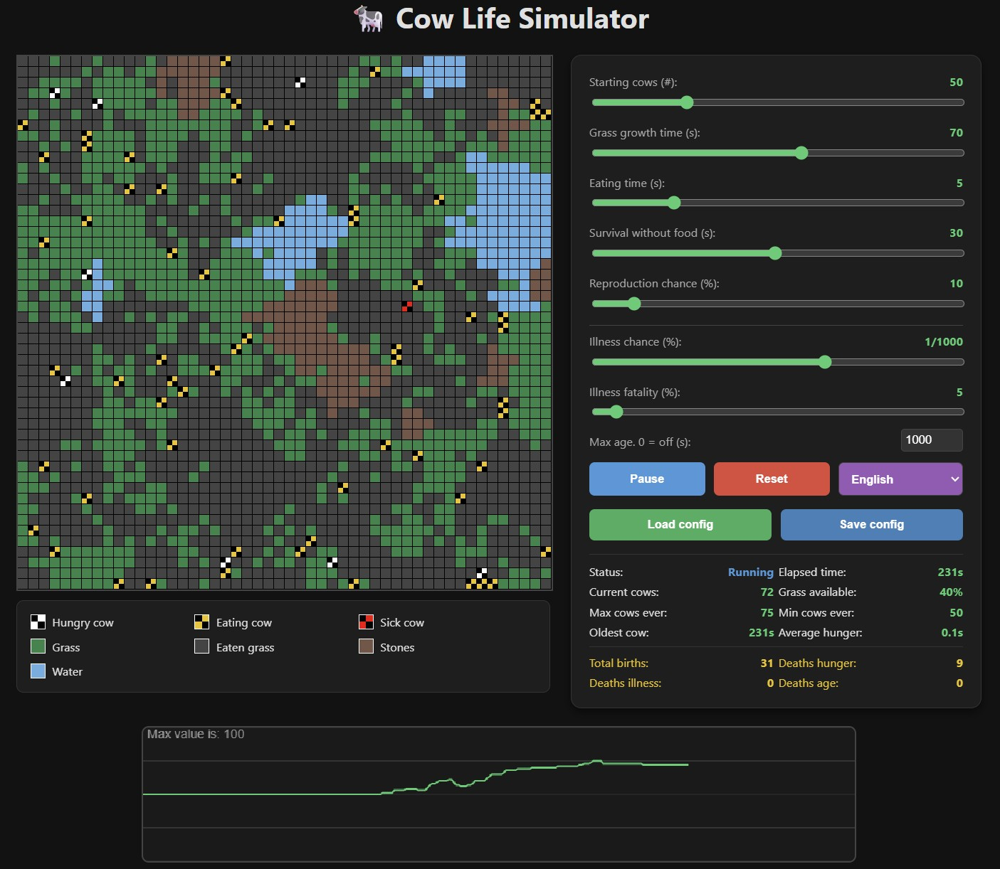

# 🐄 Cow Life Simulator - Version 1.0

**Date:** March 11, 2026

---

## Overview
Cow Life Simulator is a simple simulation designed to explore how different environmental factors and settings affect a cow population.

The goal of the game is to experiment with life-affecting variables: Will the herd thrive and grow, will they face extinction, or can you find the perfect balance to maintain a stable population?

---

## Legend & Environment
The simulation field consists of a 50x50 grid (2,500 cells).

* **Green cell:** Fresh grass.
* **Grey cell:** Eaten/depleted grass.
* **White/Black symbol:** A hungry cow searching for food.
* **Yellow/Black symbol:** A cow currently eating.
* **Red/Black symbol:** A sick cow.
* **Blue cell:** Water (impassable).
* **Brown cell:** Rocks (impassable).

### Cow Behavior
* **Searching:** A hungry cow searches for grass within a 5x5 cell radius.
* **Movement:** If no grass is found, the cow moves in a random direction.
* **Eating:** When a cow finds grass, it stays stationary to eat. You can customize how long the eating process takes.

---

## Settings & Variables
You can customize the following parameters in real-time:

* **Starting Population:** Initial number of cows.
* **Grass Growth Time:** Seconds it takes for a cell to regrow grass.
* **Eating Duration:** Seconds a cow spends eating one cell of grass.
* **Starvation Limit:** How many seconds a cow can survive without food.
* **Reproduction Chance:** Probability (%) of successful breeding.
* **Illness Chance:** Probability (%) of a cow becoming sick.
* **Illness Fatality:** Probability (%) of a sick cow dying.
* **Maximum Age:** Lifespan of a cow in seconds (0 = off).

### Health & Reproduction
* **Illness:** A sick cow can still move, eat, and reproduce. After 25 seconds, the cow will either recover or die based on the "Illness Fatality" setting.
* **Breeding Requirements:** Two cows can reproduce if:
    1.  They are in adjacent cells.
    2.  At least one of the cows is currently eating.
    3.  Both cows are older than 10% of the set "Maximum Age" (or at least 50 seconds old if Max Age is set to 0).

**Population Cap:** The population is capped at **2,100 cows** to ensure stability and performance, accounting for the space taken by rocks and water.

## 🌿 Dynamic Grass Growth (Overgrazing Mechanic)

To simulate a realistic ecosystem, the simulator features an **overgrazing mechanic**. When the cow population grows too large, the environment struggles to recover, causing grass to grow slower.

### How it works:
- **Optimal Conditions:** As long as the population is below 200 cows, grass grows at the base rate selected in the settings.
- **Overgrazing Penalty:** Once the population exceeds 200, a penalty factor is applied.
  - Effective Growth Time = Base Rate * ((Cow Count / 100) * 0.5)

### Visual Feedback
When overgrazing is active, a red multiplier (e.g., `2.50x`) will appear next to the **Grass growth time** label in the UI, indicating the current environmental strain.

# 🌍 Nature Strikes Back!

In this simulation, managing your herd size is a balance between profit and peril. If the population grows too large, nature will intervene.

## 🔥 Disaster Types
There are three types of disasters that can strike your farm. Every cow lost to these events is added to the **"Deaths illness"** counter.

| Disaster | Impact |
| :--- | :--- |
| **🦠 Disease Outbreak** | A devastating plague that wipes out **70%** of your entire herd. |
| **🔥 Fire** | Approximately **50%** of the farm area burns. All grass and cows within the affected area are lost. |
| **🌊 Flood** | Approximately **70%** of the area is submerged. All grass and cows in the flood zone are lost. |

---

## 📈 Risk & Probability
The chance of a disaster occurring is dynamic. It scales with your herd size and time played. Once you surpass **200 cows**, the environment becomes significantly more unstable.

### Probability Examples (per second):
To give you an idea of the risk escalation:

* **50 Cows:** `0.1%` chance (Stable / Low risk)
* **210 Cows:** `0.3%` chance (Warning signs)
* **250 Cows:** `1.0%` chance (High risk / Rapid escalation)
* **400 Cows:** `2.0%` chance (Critical danger)

> **Pro Tip:** Keep your herd manageable to avoid total collapse. Large-scale farming comes with large-scale consequences!

---

## Features & Controls
* **Localization:** Support for multiple languages.
* **Save/Load:** Save your custom game settings to a file or load previously saved configurations.
* **Reset:** Restarts the simulation. This clears the field and resets the population while keeping your current settings.
* **Pause/Resume:** Use the "Pause" button to halt the simulation and "Resume" to continue.
* **Real-time Adjustments:** Change settings while the game is running to see immediate reactions.
* **Browser Focus:** The simulation automatically pauses if you switch browser tabs and resumes when you return.

Have fun and... **MOOOOOOO!** :)
